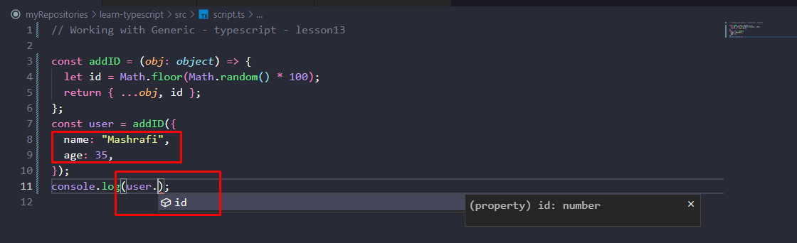
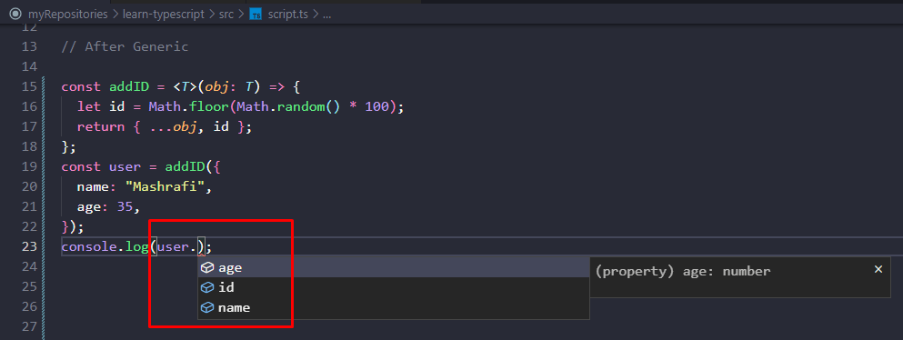

<br />
 <p align="center">
    <h1 align="center"> Generic - TypeScript - Lesson13 </h1>
</p>

### Table of Contents

- [Generic](#generic)
  - [Before Generic](#before-generic)
  - [After Generic](#after-generic)
  - [Generic and Interface both](#generic-and-interface-both)

## Generic

## Before Generic

```typescript
const addID = (obj: object) => {
  let id = Math.floor(Math.random() * 100);
  return { ...obj, id };
};
const user = addID({
  name: "Mashrafi",
  age: 35,
});
```



## After Generic

```typescript
const addID = <T>(obj: T) => {
  let id = Math.floor(Math.random() * 100);
  return { ...obj, id };
};
const user = addID({
  name: "Mashrafi",
  age: 35,
});
console.log(user.name);
```



**3. but the problem is:**

```typescript
const addID = <T>(obj: T) => {
  let id = Math.floor(Math.random() * 100);
  return { ...obj, id };
};
const user = addID("Mashrafi"); // Now addID() takes also string and etc.
```

**4. Generic => more specific**

```typescript
const addID = <T extends object>(obj: T) => {
  let id = Math.floor(Math.random() * 100);
  return { ...obj, id };
};
const user = addID("Mashrafi"); // Error: Argument of type 'string' is not assignable to parameter of type 'object'

const addID = <T extends object>(obj: T) => {
  let id = Math.floor(Math.random() * 100);
  return { ...obj, id };
};
const user = addID({
  name: "Mashrafi",
  age: 36,
});
console.log(user.name);
```

**4. Generic => more specific 2**

```typescript
const addID = <
  T extends {
    name: string;
    age: number;
  }
>(
  obj: T
) => {
  let id = Math.floor(Math.random() * 100);
  return { ...obj, id };
};
const user = addID({
  name: "Mashrafi",
  age: 36,
});
console.log(user.age);
```

## Generic and Interface both

```typescript
interface APIResponse<T> {
  status: number;
  type: string;
  data: T;
}
const response: APIResponse<object> = {
  status: 300,
  type: "something",
  data: {
    value: "something",
    num: 150,
  },
};
```

```typescript
interface APIResponse<T> {
  status: number;
  type: string;
  data: T;
}

const response: APIResponse<string> = {
  status: 200,
  type: "something",
  data: "test",
};
```

<br/>
